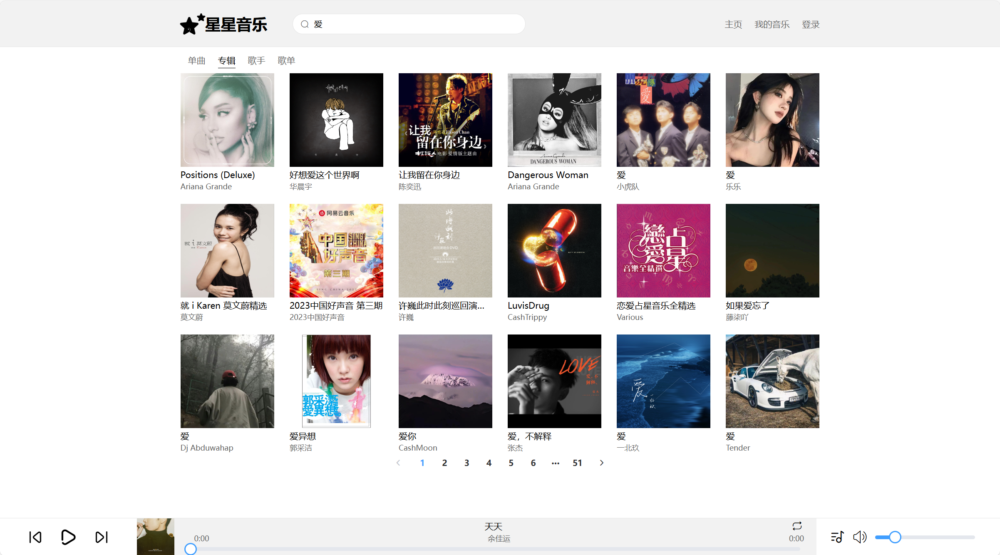
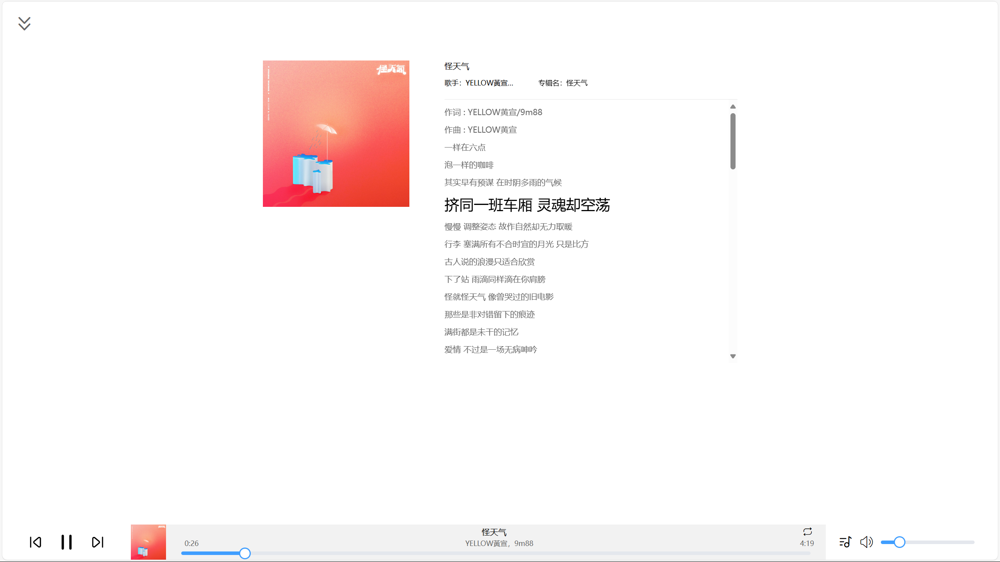

# 星星音乐

## 概述

该网页播放器，使用的是网易云的 API 接口

### 基本播放控制

- **播放**：开始播放选定的歌曲。
- **暂停**：暂停当前播放的歌曲。
- **停止**：停止播放并重置播放进度。
- **上一曲**：播放上一首歌曲。
- **下一曲**：播放下一首歌曲。

### 搜索功能

- 用户可以按**歌名**、**歌手名**、**专辑名**等关键词搜索歌曲，快速找到想听的音乐。

### 音量调节

- **音量调节**：支持滑动调节音量大小。
- **静音**：一键静音当前播放的歌曲。
- **恢复音量**：从静音状态恢复到之前的音量。

### 歌词显示

- **歌词滚动**：同步显示歌词，跟随音乐滚动。
- **高亮显示**：高亮显示当前播放的歌词行，方便用户跟唱。

### 播放列表管理

- **支持本地缓存歌单功能** ：关闭网页，下次打开该网页列表歌单不丢失。
- **添加到播放列表**：用户可以将喜欢的歌曲添加到播放列表。
- **播放模式**：
  - **顺序播放**：按照播放列表的顺序播放歌曲。
  - **随机播放**：随机播放播放列表中的歌曲。
  - **单曲循环**：循环播放当前歌曲。

## 总结

这款网页音乐播放器通过简洁直观的界面设计和丰富的功能，为用户提供了极佳的音乐播放体验。无论是基本的播放控制，还是高级的歌词显示和播放列表管理，都能满足用户的多样化需求。

## 使用须知

**前端**：

```shell
git clone git@github.com:Takari-zero/star-music.git
cd star-star-music
npm i
npm run serve
```

**后端**:

```shell
npx NeteaseCloudMusicApi
```

## 截图





